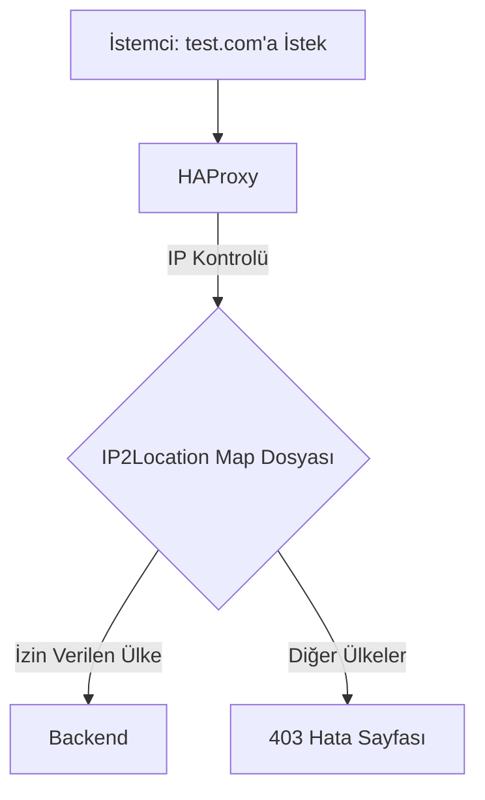

# HAProxy ile Türkiye IP'lerini Filtreleme

Bu proje, [IP2Location LITE DB1.LITE](https://lite.ip2location.com/) veritabanını kullanarak HAProxy ile yalnızca Türkiye IP adreslerinden gelen HTTP isteklerine izin vermek için otomatik bir çözüm sunar. Türkiye dışından gelen istekler, özelleştirilmiş bir 403 hata sayfasıyla engellenir. Proje, IP2Location veritabanını düzenli olarak indirip güncelleyen bir betik, CSV verisini HAProxy’nin anlayacağı CIDR formatına dönüştüren bir Python scripti ve bu süreci otomatikleştiren bir cron betiği içerir.

## Özellikler
- **Otomatik Güncelleme**: IP2Location LITE veritabanını aylık olarak indirir ve HAProxy map dosyasına dönüştürür.
- **Türkiye IP Filtresi**: Yalnızca Türkiye’den gelen IP adreslerine izin verir, diğerlerini engeller.
- **Hata Sayfası**: Türkiye dışından gelen istekler için özelleştirilmiş bir 403 hata sayfası gösterir.
- **Günlük Kaydı**: Güncelleme sürecinin takibi için ayrıntılı log dosyası oluşturur.
- **Hata Yönetimi**: İndirme, dönüştürme ve HAProxy yeniden yükleme adımlarında hata kontrolü yapar.

## Gereksinimler
- **HAProxy**: 2.4 veya üstü (test edildi: 2.4.24)
- **Python 3**: `ipaddress` modülü ile
- **Linux Araçları**: `wget`, `unzip`, `cron`
- **IP2Location LITE Download Token**: [IP2Location](https://lite.ip2location.com/) hesabınızdan ücretsiz bir token alın
- **SSL Sertifikası**: HTTPS için geçerli bir sertifika (örneğin, `/etc/haproxy/certs/cluster.crtlist`)
- **Hata Sayfası**: Özelleştirilmiş 403 hata sayfası (örneğin, `/etc/haproxy/errors/403-turkey-only.html`)

## Kurulum Adımları

### 1. HAProxy Yapılandırmasını Ayarlayın
HAProxy yapılandırması, Türkiye IP’lerini kontrol eden bir ACL kullanır ve Türkiye dışından gelen istekleri engeller.

1. Örnek yapılandırma dosyasını (`haproxy.cfg`) `/etc/haproxy/haproxy.cfg` yoluna kopyalayın:
   ```bash
   sudo cp haproxy.cfg /etc/haproxy/haproxy.cfg
   ```
2. SSL sertifikanızı `/etc/haproxy/certs/cluster.crtlist` yoluna yerleştirin.
3. Özelleştirilmiş 403 hata sayfasını oluşturun:
   ```bash
   sudo mkdir -p /etc/haproxy/errors
   echo '<html><body><h1>403 Forbidden</h1><p>Bu siteye yalnızca Türkiye\'den erişilebilir.</p></body></html>' | sudo tee /etc/haproxy/errors/403-turkey-only.html
   ```
4. HAProxy yapılandırmasını test edin:
   ```bash
   sudo haproxy -c -f /etc/haproxy/haproxy.cfg
   ```

### 2. Python Scriptini Kurun
`convert_ip2location.py`, IP2Location CSV dosyasını HAProxy’nin anlayacağı CIDR formatında bir map dosyasına dönüştürür.

1. Scripti `/root/` dizinine kopyalayın:
   ```bash
   cp convert_ip2location.py /root/
   ```
2. Gerekli Python modülünü kurun:
   ```bash
   sudo apt-get install python3 python3-pip
   pip3 install ipaddress
   ```
3. Scripti test edin:
   ```bash
   python3 /root/convert_ip2location.py
   head /etc/haproxy/tr-ip-list.map
   ```
   **Beklenen Çıktı**:
   ```
   2.16.150.0/23
   2.17.0.0/22
   ...
   ```

### 3. Cron Betiğini Kurun
`update-ip2location.sh`, IP2Location veritabanını indirir, açar, dönüştürür ve HAProxy’yi yeniden yükler.

1. Betiği `/etc/cron.weekly/` dizinine kopyalayın:
   ```bash
   cp update-ip2location.sh /etc/cron.weekly/
   chmod +x /etc/cron.weekly/update-ip2location
   ```
2. Gerekli araçları kurun:
   ```bash
   sudo apt-get install wget unzip
   ```
3. Betiği test edin:
   ```bash
   /etc/cron.weekly/update-ip2location
   cat /var/log/update-ip2location.log
   ```
   **Beklenen Çıktı** (log dosyası):
   ```
   Fri Jun 27 13:47:00 +03 2025: Betik başladı
   Fri Jun 27 13:47:05 +03 2025: Betik başarıyla tamamlandı
   ```

### 4. Cron ile Otomatik Güncellemeyi Ayarlayın
Betiği haftalık çalıştırmak için `/etc/cron.weekly/` yeterlidir (sistem varsayılan olarak pazar sabah 06:47’de çalıştırır). Aylık çalıştırmak için `crontab`’a ekleyin:

1. `crontab`’ı düzenleyin:
   ```bash
   crontab -e
   ```
2. Aşağıdaki satırı ekleyin (her ayın 1’inde sabah 02:00):
   ```
   0 2 1 * * /etc/cron.weekly/update-ip2location
   ```
3. Çift çalıştırmayı önlemek için betiği `/etc/cron.weekly/`’den taşıyabilirsiniz:
   ```bash
   mv /etc/cron.weekly/update-ip2location /root/update-ip2location.sh
   ```
   Ardından `crontab`’ı güncelleyin:
   ```
   0 2 1 * * /root/update-ip2location.sh
   ```

### 5. HAProxy’yi Yeniden Başlatın
Yapılandırmayı uygulayın:
```bash
sudo systemctl restart haproxy
sudo systemctl status haproxy
```

### 6. Birden Fazla Ülkeye İzin Verme
Sistem, varsayılan olarak yalnızca Türkiye IP’lerine izin verir. Ancak, birden fazla ülkeye (örneğin, Türkiye, ABD, İngiltere) izin vermek için aşağıdaki adımları izleyin:

#### 6.1 Python Scriptini Güncelleyin
`convert_ip2location.py` dosyasını, istenen ülkelerin IP aralıklarını bir map dosyasına (`allowed-ip-list.map`) yazacak şekilde düzenleyin:

1. Scripti düzenleyin:
   ```bash
   nano /root/convert_ip2location.py
   ```
2. Aşağıdaki içeriği kullanın:
   ```python
   import csv
   import ipaddress
   import sys

   input_file = "/etc/haproxy/IP2LOCATION-LITE-DB1.CSV"
   output_file = "/etc/haproxy/allowed-ip-list.map"
   allowed_countries = ['TR', 'US', 'UK']  # İzin verilecek ülkeler

   def int_to_ip(ip_int):
       try:
           return str(ipaddress.IPv4Address(int(ip_int)))
       except ValueError as e:
           print(f"Hata: Geçersiz IP sayısı - {ip_int}: {e}")
           sys.exit(1)

   print(f"[{sys.argv[0]}] Başladı: CSV dosyası ({input_file}) işleniyor...")

   try:
       with open(input_file, "r") as csv_file, open(output_file, "w") as map_file:
           reader = csv.reader(csv_file)
           count = 0
           for row in reader:
               if len(row) < 4:
                   print(f"Uyarı: Geçersiz CSV satırı: {row}")
                   continue
               ip_from, ip_to, country_code, country_name = row
               if country_code in allowed_countries:
                   try:
                       start_ip = int_to_ip(ip_from)
                       end_ip = int_to_ip(ip_to)
                       networks = ipaddress.summarize_address_range(ipaddress.IPv4Address(start_ip), ipaddress.IPv4Address(end_ip))
                       for net in networks:
                           map_file.write(f"{net}\n")
                           count += 1
                   except ValueError as e:
                       print(f"Hata: IP aralığı dönüştürülemedi ({ip_from}-{ip_to}): {e}")
           print(f"[{sys.argv[0]}] Başarıyla tamamlandı: {count} IP aralığı {output_file} dosyasına yazıldı.")
   except FileNotFoundError as e:
       print(f"Hata: {input_file} dosyası bulunamadı: {e}")
       sys.exit(1)
   except Exception as e:
       print(f"Hata: Beklenmeyen hata oluştu: {e}")
       sys.exit(1)
   ```
3. Scripti test edin:
   ```bash
   python3 /root/convert_ip2location.py
   head /etc/haproxy/allowed-ip-list.map
   ```
   **Beklenen Çıktı**:
   ```
   2.16.150.0/23
   3.0.0.0/15
   ...
   ```

#### 6.2 HAProxy Yapılandırmasını Güncelleyin
`haproxy.cfg` dosyasını, yeni map dosyasını (`allowed-ip-list.map`) kullanacak şekilde düzenleyin:

1. Dosyayı düzenleyin:
   ```bash
   nano /etc/haproxy/haproxy.cfg
   ```
2. Şu satırları:
   ```haproxy
   acl is_turkey_ip src -f /etc/haproxy/tr-ip-list.map
   http-request return status 403 content-type text/html file /etc/haproxy/errors/403-turkey-only.html if !is_turkey_ip
   ```
   Şununla değiştirin:
   ```haproxy
   acl is_allowed_ip src -f /etc/haproxy/allowed-ip-list.map
   http-request return status 403 content-type text/html file /etc/haproxy/errors/403-blocked.html if !is_allowed_ip
   ```
3. Yeni bir hata sayfası oluşturun (isteğe bağlı):
   ```bash
   echo '<html><body><h1>403 Forbidden</h1><p>Bu siteye yalnızca belirli ülkelerden erişilebilir.</p></body></html>' | sudo tee /etc/haproxy/errors/403-blocked.html
   ```
4. Yapılandırmayı test edin ve HAProxy’yi yeniden yükleyin:
   ```bash
   sudo haproxy -c -f /etc/haproxy/haproxy.cfg
   sudo systemctl reload haproxy
   ```

#### 6.3 Cron Betiğini Güncelleyin
`update-ip2location.sh` dosyasını, yeni map dosyasını (`allowed-ip-list.map`) kontrol edecek şekilde güncelleyin:

1. Betiği düzenleyin:
   ```bash
   nano /etc/cron.weekly/update-ip2location
   ```
2. Aşağıdaki içeriği kullanın:
   ```bash
   #!/bin/bash
   # /etc/cron.weekly/update-ip2location
   set -e  # Hata durumunda betiği durdur
   LOG_FILE="/var/log/update-ip2location.log"

   echo "$(date): Betik başladı" >> "$LOG_FILE"

   # ZIP dosyasını indir
   wget -O /etc/haproxy/IP2LOCATION-LITE-DB1.CSV.zip "https://www.ip2location.com/download?token=[YOUR_TOKEN]&file=DB1LITE" 2>> "$LOG_FILE"
   if [ $? -ne 0 ]; then
       echo "$(date): ZIP dosyası indirilemedi" >> "$LOG_FILE"
       exit 1
   fi

   # ZIP dosyasını aç
   unzip -o /etc/haproxy/IP2LOCATION-LITE-DB1.CSV.zip -d /etc/haproxy/ 2>> "$LOG_FILE"
   if [ $? -ne 0 ]; then
       echo "$(date): ZIP dosyası açılamadı" >> "$LOG_FILE"
       exit 1
   fi

   # Python scriptini çalıştır
   python3 /root/convert_ip2location.py 2>> "$LOG_FILE"
   if [ $? -ne 0 ]; then
       echo "$(date): Python scripti başarısız oldu" >> "$LOG_FILE"
       exit 1
   fi

   # Map dosyasını kontrol et
   if [ ! -s /etc/haproxy/allowed-ip-list.map ]; then
       echo "$(date): Map dosyası oluşturulmadı veya boş" >> "$LOG_FILE"
       exit 1
   fi

   # Dosya izinlerini güncelle
   chmod 644 /etc/haproxy/allowed-ip-list.map >> "$LOG_FILE" 2>&1
   chown haproxy:haproxy /etc/haproxy/allowed-ip-list.map >> "$LOG_FILE" 2>&1

   # HAProxy’yi yeniden yükle
   systemctl reload haproxy >> "$LOG_FILE" 2>&1
   if [ $? -ne 0 ]; then
       echo "$(date): HAProxy yeniden yüklenemedi" >> "$LOG_FILE"
       exit 1
   fi

   echo "$(date): Betik başarıyla tamamlandı" >> "$LOG_FILE"
   ```
3. Betiği test edin:
   ```bash
   /etc/cron.weekly/update-ip2location
   cat /var/log/update-ip2location.log
   ```

#### 6.4 Ülke Kodlarını Özelleştirme
`allowed_countries` listesini dilediğiniz ülkelerle güncelleyin. Örneğin:
- Türkiye: `TR`
- Amerika: `US`
- İngiltere: `UK`
- Almanya: `DE`
- Japonya: `JP`

Ülke kodlarını [IP2Location’un ülke kodları listesinden](https://www.ip2location.com/country-code) alabilirsiniz. Örneğin:
```python
allowed_countries = ['TR', 'US', 'UK', 'DE', 'JP']
```

#### 6.5 Test Etme
Sistemi test etmek için:
1. Güncellenmiş scripti çalıştırın:
   ```bash
   python3 /root/convert_ip2location.py
   ```
2. Map dosyasını kontrol edin:
   ```bash
   head /etc/haproxy/allowed-ip-list.map
   ```
3. VPN kullanarak izin verilen ülkelerden (örneğin, TR, US, UK) ve izin verilmeyen ülkelerden bağlanmayı deneyin. İzin verilmeyen ülkeler için 403 hata sayfası görmelisiniz.

## Sistem Akışı
Aşağıdaki diyagram, sistemin HTTP isteklerini nasıl işlediğini gösterir:


## Dosyalar
- **`haproxy.cfg`**: HAProxy yapılandırması. Türkiye IP’lerini kontrol eder ve diğerlerini engeller.
- **`convert_ip2location.py`**: IP2Location CSV dosyasını CIDR formatında `/etc/haproxy/tr-ip-list.map` veya `/etc/haproxy/allowed-ip-list.map` dosyasına dönüştürür.
- **`update-ip2location.sh`**: Veritabanını indirir, açar, dönüştürür ve HAProxy’yi yeniden yükler.

## Kullanım Senaryoları
- **Web Sitesi Kısıtlaması**: Türkiye veya seçilen ülkeler dışından gelen istekleri engelleyerek yalnızca belirli kullanıcılara hizmet sunar.
- **Güvenlik**: Kötü niyetli User-Agent’ları (örneğin, `sqlmap`, `curl/7.0`, `wget`) engeller.
- **Otomasyon**: IP veritabanını düzenli olarak güncelleyerek manuel müdahaleyi ortadan kaldırır.

## Hata Giderme
- **Map Dosyası Oluşmadıysa**:
  ```bash
  python3 /root/convert_ip2location.py
  cat /var/log/update-ip2location.log
  ```
- **HAProxy Hataları**:
  ```bash
  sudo haproxy -c -f /etc/haproxy/haproxy.cfg
  ```
- **İndirme Sorunları**: IP2Location token’ınızı kontrol edin veya kota aşımı için yeni bir token alın.

## Log Yönetimi
Günlük dosyası (`/var/log/update-ip2location.log`) büyümesini önlemek için `logrotate` kullanın:
```bash
sudo nano /etc/logrotate.d/update-ip2location
```
İçerik:
```
/var/log/update-ip2location.log {
    weekly
    rotate 4
    compress
    missingok
    notifempty
}
```

## Lisans
Bu proje [MIT lisansı](LICENSE) altında dağıtılmaktadır. Ancak, IP2Location LITE veritabanı [CC BY-SA 4.0](https://creativecommons.org/licenses/by-sa/4.0/) lisansı altındadır. Veritabanını kullanırken IP2Location’a atıfta bulunmanız gerekir.

## Notlar
- **IP2Location Kısıtlamaları**: Veritabanı aylık indirilebilir. Kota aşımı durumunda [IP2Location](https://lite.ip2location.com/)’dan yeni token alın.
- **IPv6 Desteği**: IPv6 için `DB1LITEIPV6` dosyasını kullanabilirsiniz. `convert_ip2location.py` dosyasını buna göre güncelleyin.
- **Performans**: Büyük map dosyaları için HAProxy’nin bellek kullanımını izleyin (`stick-table size 1m` genellikle yeterlidir).

